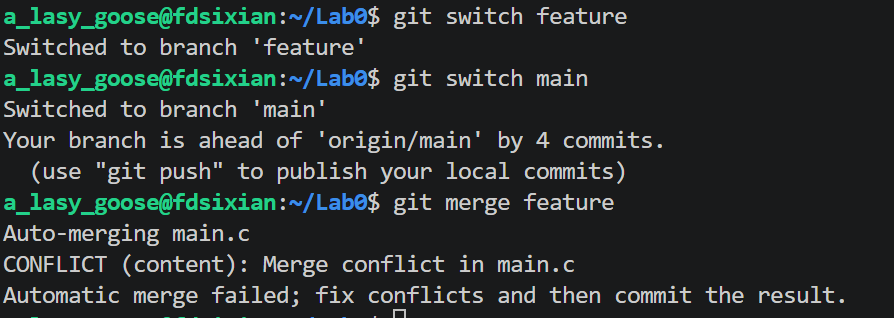
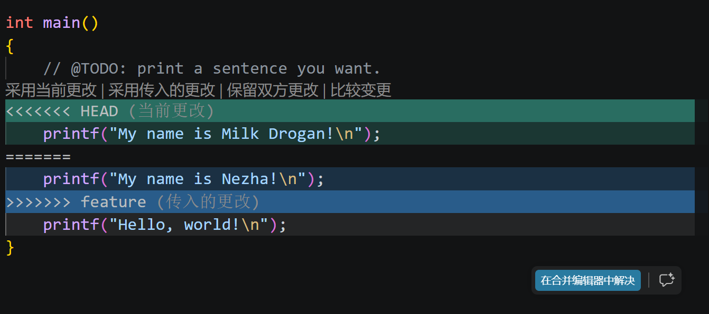
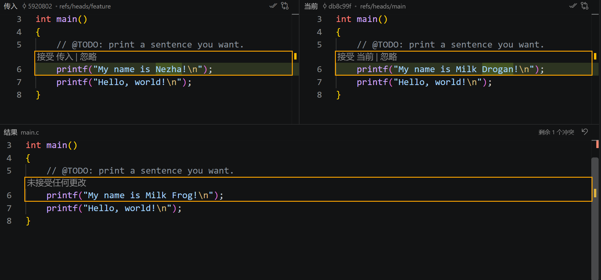

# Lab0：GitLab Report

## 1.1 
我之前是有过多人协同开发经历的。我们三人小组进行了一款模拟车机智能导航助手的网页页面开发，使用的分工协调方式就是各自完成所负责的模块，然后统一使用git进行项目管理与更新。

## 1.2 
我认为原因有二：
- **防止更新内容混乱**：假如程序员一次更改了好几份文件，直接提交可能会导致更新内容杂糅在一起，造成版本混乱。叫修改内容放在缓存区，可以自行选择管理一次更新所提交的内容，便于表达程序员清晰的意图，便于代码审查回退；
- **允许提交前审查**：若提交的内容中含有未完成的代码和敏感内容等，直接提交会造成严重后果。先行置于暂存区，提交前可以自行审查并选择安全有效的部分上传，使得项目安全性得以保障。

## 1.3
我读完第一第二个网页，认为git优势如下：
- **保存版本信息**：Git提交代码时保存每一版本的代码，并且要求撰写Commit message，这记录下了每一次更新的修改人员和修改内容，能够更加清晰的比较版本差异，便于后续代码回退和审查。
- **分支管理系统方便协同开发**：不同开发者可以在不同分支独立完成各自任务，减少彼此之间的干扰，最终合并成果。这大大提升了大型项目合作开发的时间效率。
- **精准选择版本修改信息**：Git通过对“暂存-提交”步骤的设计，使得开发者每次提交可自行选择提交内容，使得版本更新内容更加清晰明确，以及项目开发过程更加安全保障。

## 4
- 开始在main上进行TODO任务填写，进行初次提交；

- 创建feature分支，在该分支上修改了一次代码并且提交；
- 又在main分支上修改了一次相同位置处的代码并且提交；
- 最终将feature上的提交merge到main产生冲突如下：

- 解决方式为选择其中一个版本进行保留：
